# LiDAR-based vegetation change after the 2025 Palisades Fire
## Overview

This project investigates changes in vegetation structure following the January 2025 Palisades Fire in Southern California using pre- and post-fire LiDAR data. The analysis focuses on changes in canopy height, vegetation structure, and low-height LiDAR return density between 2023 and 2025.

The workflow combines LiDAR-derived digital surface models (DSM), digital terrain models (DTM), canopy height models (CHM), vegetation change analysis, NOAA land-cover data, and 3D point-cloud visualization in CloudCompare. Sentinel-2 imagery was additionally processed in Google Earth Engine to provide complementary spectral information on vegetation condition.

## Research Questions

This project addresses the following research questions:

1. How much canopy height was lost following the 2025 Palisades Fire, and how did this loss differ between Upland Tree and Scrub/Shrub areas?

2. How did low-height vegetation structure change between the pre-fire and post-fire LiDAR acquisitions?

3. How did vegetation condition change following the fire, and is subsequent vegetation recovery visible in the Sentinel-2 time series?

## Data Sources

The analysis combines airborne LiDAR data, NOAA vegetation classification, Sentinel-2 satellite imagery, and fire progression data to assess vegetation structure and change following the 2025 Palisades Fire in Southern California.

The LiDAR datasets were accessed and downloaded through the [USGS National Map LiDAR Explorer](https://apps.nationalmap.gov/lidar-explorer/#/). The specific pre- and post-fire datasets used in this analysis are listed below.

| Data Type | Source/Dataset | Acquisition | Notes |
|-----------|----------------|-------------|-------|
| LiDAR | [USGS `CA_LosAngeles_1_B23`](https://portal.opentopography.org/usgsDataset?dsid=CA_LosAngeles_1_B23) | Dec 2023 | Pre-fire airborne LiDAR |
| LiDAR | [USGS `CA_2025LosAngelesPostWildfire_C25`](https://rockyweb.usgs.gov/vdelivery/Datasets/Staged/Elevation/LPC/Projects/CA_2025LosAngelesPostWildfire_C25/CA_LAPostWildfire_Palisades_C25/LAZ/) | 21 Jan 2025 | Post-fire airborne LiDAR |
| Vegetation Classification | [NOAA C-CAP](https://www.fisheries.noaa.gov/inport/item/70562) | 2021 | Upland Tree and Scrub/Shrub classes |
| Satellite Imagery | [Sentinel-2 SR Harmonized](https://developers.google.com/earth-engine/datasets/catalog/COPERNICUS_S2_SR_HARMONIZED) | Dec 2023–Jan 2026 | NDVI and NBR |


## Study area

The study area is located in the Santa Monica Mountains in Southern California, within the area affected by the 2025 Palisades Fire.

The region was selected because the fire spread rapidly through the area during the early phase of the incident. On January 8, 2025, extreme fire behavior, including short- and long-range spotting, continued to support further fire spread. The study area includes the Southern Topanga Canyon corridor, which was affected during the fire progression.

The fire progression shown below provides the spatial context for the selected study area.

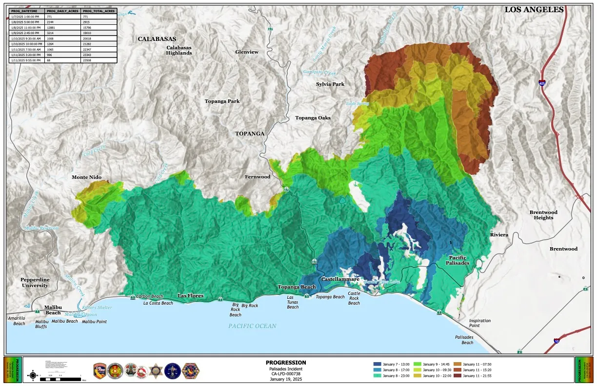

*Figure source: [The Lookout](https://the-lookout.org/2025/01/21/progression-of-the-palisades-fire/) (2025).*

The analysis focuses on a selected area where pre- and post-fire LiDAR data are available, allowing vegetation structure to be compared between 2023 and 2025.

## Workflow
- [1. Canopy Height Loss after the Palisades Fire](#1-canopy-height-loss-after-the-palisades-fire)
  - [1.1 DSM and DTM Calculation](#11-dsm-and-dtm-calculation)
  - [1.2 Canopy Height Model Calculation](#12-canopy-height-model-calculation)
  - [1.3 LiDAR 3D Visualization](#13-lidar-3d-visualization)
  - [1.4 Vegetation Classes and Canopy Height Loss](#14-vegetation-classes-and-canopy-height-loss)
- [2. Understory Vegetation Loss](#2-understory-vegetation-loss)
- [3. Sentinel-2 Spectral Indices](#3-sentinel-2-spectral-indices)
  - [3.1 NDVI](#31-ndvi)
  - [3.2 NBR](#32-nbr)
- [4. Limitations](#4-limitations)
- [5. Conclusion](#5-conclusion)

## 1. Canopy Height Loss after the Palisades Fire
### 1.1 DSM and DTM Calculation

The LiDAR processing was carried out in R using the `lidR` and `terra` packages. `lidR` was used for LiDAR point-cloud processing, terrain and canopy surface modelling, and rasterization, while `terra` was used for raster processing, masking, resampling, and spatial alignment. DSMs and DTMs were generated from the 2023 and 2025 point clouds at 1 m spatial resolution.

```r
# Calculate DSMs 
dsm_2023 <- rasterize_canopy(ctg_2023, layout = template, algorithm = p2r())
dsm_2025 <- rasterize_canopy(ctg_2025, layout = template, algorithm = p2r())

# Calculate DTMs 
dtm_2023 <- rasterize_terrain(ctg_2023, layout = template, algorithm = tin())
dtm_2025 <- rasterize_terrain(ctg_2025, layout = template, algorithm = tin())
```

(See [`02_DSM_DTM.R`](scripts/02_DSM_DTM.R)).

### 1.2 Canopy Height Model Calculation 

Canopy Height Models (CHM) were calculated as the difference between the DSM and DTM. 

```r
# Resample DSMs & DTMs 
dsm_2023 <- resample(dsm_2023, dtm_2023, method = "bilinear")
dsm_2025 <- resample(dsm_2025, dtm_2025, method = "bilinear")

# Calculate CHMs for both years 
chm_2023 <- dsm_2023 - dtm_2023
chm_2025 <- dsm_2025 - dtm_2025

# Mask with NOAA vegetation mask 
chm_2023_noaa <- mask(chm_2023, veg_mask)
chm_2025_noaa <- mask(chm_2025, veg_mask)
```

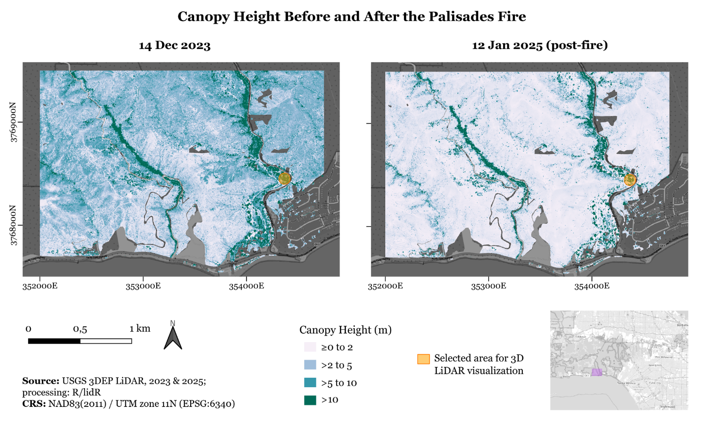

The figure provides an overview of the study area before and after the fire. The visual comparison of the 2023 and 2025 CHMs shows a clear reduction in vegetation height following the fire. In the 2023 pre-fire CHM, much of the study area is characterized by vegetation heights above 2 m, with large areas ranging between 2 and 5 m and higher vegetation concentrated along Topanga Canyon Boulevard (CA-27). The taller vegetation along the road includes areas with CHM values above 5 m and locally above 10 m, reflecting the presence of larger trees. The surrounding areas are dominated by lower vegetation, including shrub-dominated areas with CHM values mainly between 2 and 5 m.

In the 2025 post-fire CHM, vegetation height is substantially reduced across much of the study area. Most pixels show CHM values between 0 and 2 m, while higher vegetation remains mainly along Topanga Canyon Boulevard and along another major road. Areas with CHM values above 2 m, 5 m, and locally 10 m are still present, but are considerably less extensive than in 2023. The spatial pattern therefore provides a clear visual indication of the substantial loss of vegetation height between the pre-fire and post-fire acquisitions.

The marked location indicates the area selected for the subsequent 3D LiDAR visualization in CloudCompare (see 1.3 3D LiDAR visualization). This allows the spatial location of the detailed point-cloud examples to be related back to the full study area.

In a next step, the canopy height change was calculated by subtracting the 2023 CHM from the 2025 CHM:

```r
# Create change CHM between 2023 and 2025
chm_change_veg <- chm_2025_noaa - chm_2023_noaa
```

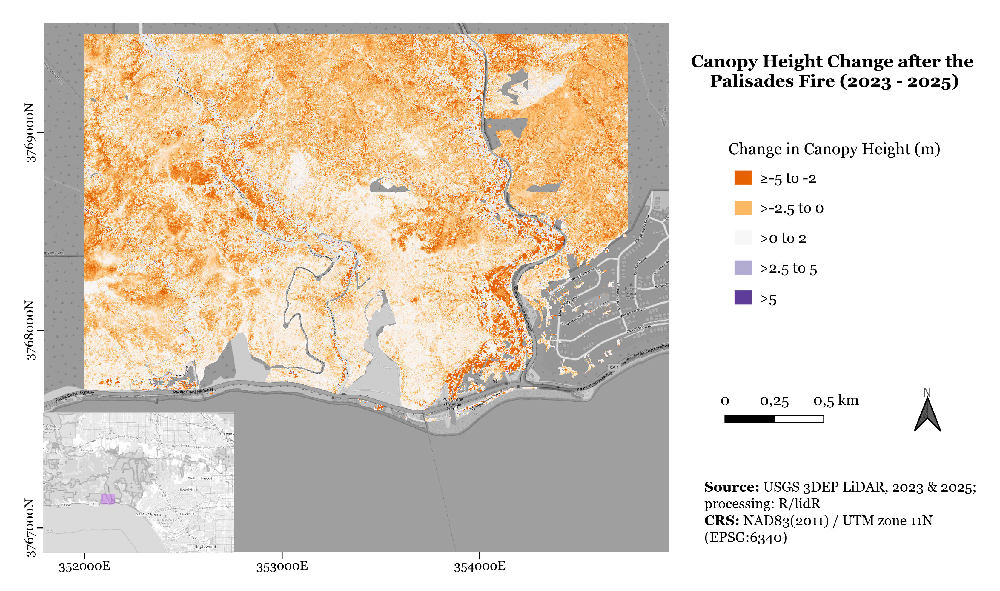

Negative values indicate a decrease in vegetation height between the two LiDAR acquisitions, while positive values indicate an increase. 

The CHM change map shows a predominantly negative change in canopy height across the study area. Most of the area is shown in orange, representing a decrease in canopy height between approximately 0 and −2.5 m. More pronounced decreases are visible along Topanga Canyon Boulevard, extending towards the coast, where orange-red areas indicate canopy height changes between approximately −5 and −2 m. These patterns correspond to the areas where taller vegetation was present in the 2023 pre-fire CHM and where substantial reductions in vegetation height are visible in the 2025 post-fire CHM.

### 1.3 LiDAR 3D Visualization

To provide a closer look at changes in vegetation structure, selected areas were extracted from the LiDAR point clouds using R and visualized in CloudCompare.

```r
# Define a small area for 3D visualization
cc_ext <- ext(354250, 354450, 3768390, 3768590)

# Clip LiDAR point clouds for CloudCompare
las_2023_cc <- clip_rectangle(ctg_2023, 354250, 3768390, 354450, 3768590)
las_2025_cc <- clip_rectangle(ctg_2025, 354250, 3768390, 354450, 3768590)
```
The four visualizations show the same area before and after the fire. The larger views provide spatial context, while the zoomed views focus on a smaller area of pronounced structural change. The zoomed area was additionally outlined using a cylinder to highlight the selected section of the point cloud.

All four visualizations display the LiDAR Z values using the same range from 14.1 to 58 m to allow direct visual comparison between 2023 and 2025. The comparison shows a clear reduction in vegetation structure between the pre-fire and post-fire point clouds. In the 2023 point cloud, the selected area contains dense and vertically continuous vegetation, including several taller vegetation structures. In the 2025 point cloud, these structures are substantially reduced, with large parts of the previously vegetated area showing much lower point elevations. The visual difference is particularly apparent in the zoomed views, where the loss of vegetation height and density can be directly observed.


#### 2023

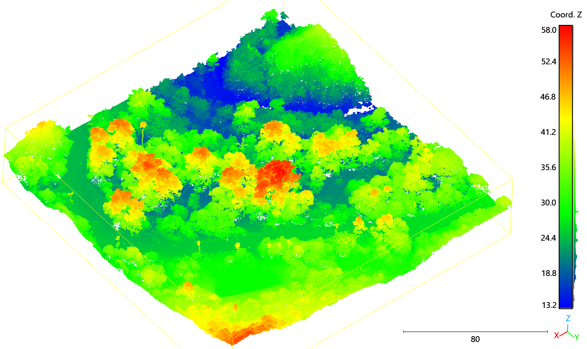

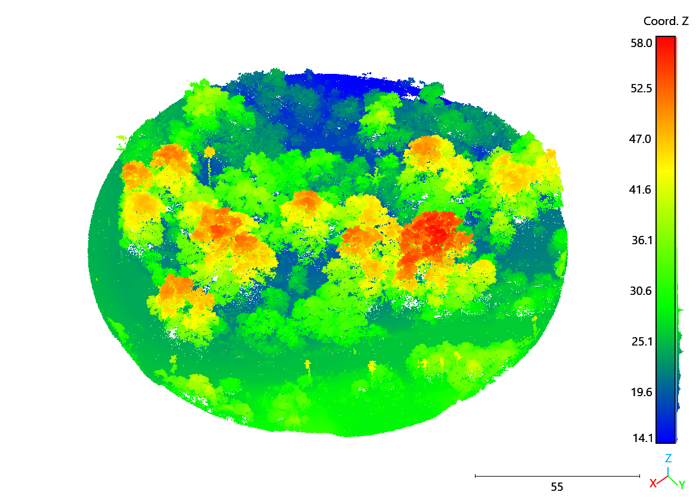

#### 2025

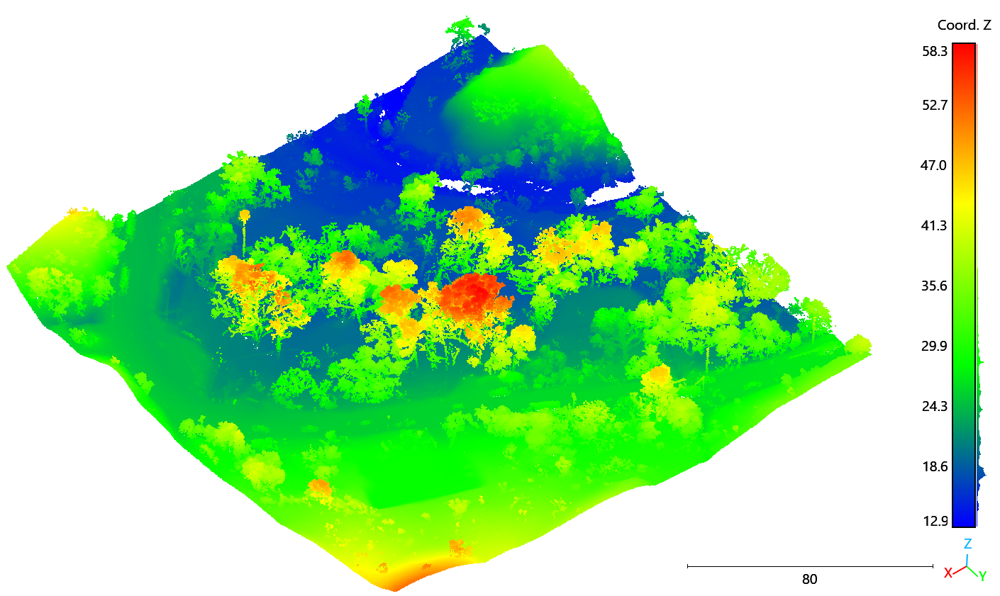

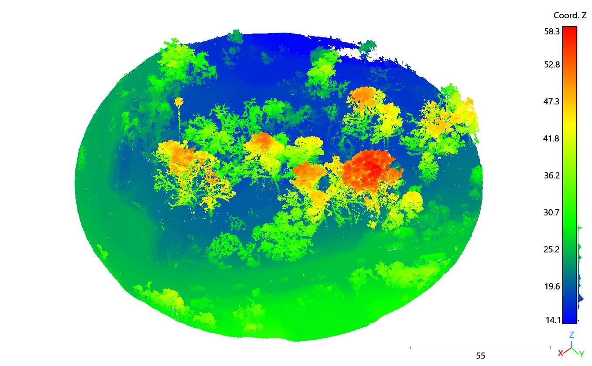

### 1.4 Vegetation Classes and Canopy Height Loss 

A NOAA C-CAP land-cover dataset was used to distinguish between **Upland Tree (Forest)** and **Scrub/Shrub** vegetation. Canopy height loss was compared between these vegetation classes.


```r
# Align NOAA land cover raster to LiDAR template
noaa_aligned <- project(
  noaa,
  template,
  method = "near"
)

# Vegetation mask
# class 1 = trees (forest)
# class 2 = shrubs
veg_mask <- ifel(
  noaa_aligned == 1 | noaa_aligned == 2,
  1,
  NA
)
```

The following figure shows the NOAA mask used to define these vegetation classes within the LiDAR analysis area.

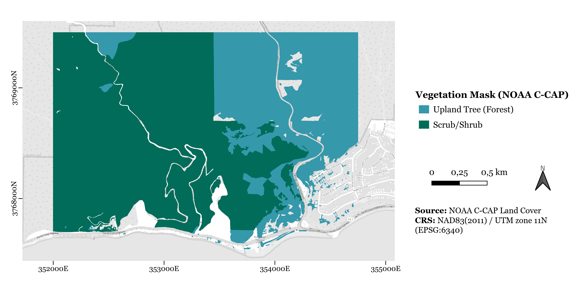

The CHM change data were subsequently summarized separately for forest and shrub areas. Vegetation height loss was grouped into different severity classes based on the magnitude of CHM decrease.

```r
# Separate CHM change by vegetation class
tree_mask <- ifel(noaa_aligned == 1, 1, NA)
scrub_mask <- ifel(noaa_aligned == 2, 1, NA)

chm_change_tree <- mask(chm_change_clean, tree_mask)
chm_change_scrub <- mask(chm_change_clean, scrub_mask)

# Calculate pixels by CHM loss severity
tree_pixels <- c(
  sum(values_tree < -1 & values_tree >= -2),
  sum(values_tree < -2 & values_tree >= -5),
  sum(values_tree < -5)
)

scrub_pixels <- c(
  sum(values_scrub < -1 & values_scrub >= -2),
  sum(values_scrub < -2 & values_scrub >= -5),
  sum(values_scrub < -5)
)

# Convert pixel counts to area and percentage
area_table <- data.frame(
  CHM_decrease = c("-1 to -2 m", "< -2 to -5 m", "< -5 m"),
  Tree_ha = tree_pixels / 10000,
  Tree_percent = tree_pixels / tree_loss_total * 100,
  Scrub_ha = scrub_pixels / 10000,
  Scrub_percent = scrub_pixels / scrub_loss_total * 100
)
```

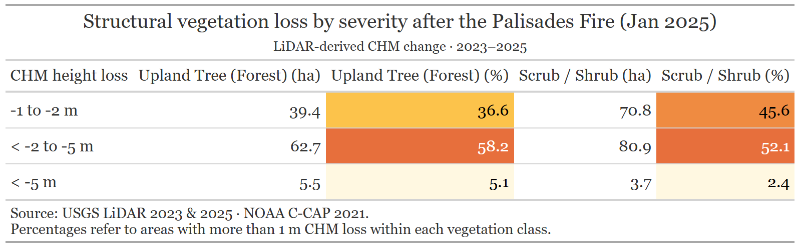

The table summarizes the distribution of canopy height loss within Upland Tree and Scrub/Shrub areas. The percentages refer only to areas within each vegetation class where more than 1 m of CHM loss was detected. Therefore, the summed areas of 107.6 ha for Upland Tree and 155.4 ha for Scrub/Shrub represent the areas affected by more than 1 m of canopy height loss, rather than the total extent of the respective vegetation classes.

In both vegetation classes, the largest proportion of areas with more than 1 m of canopy height loss falls within the 2–5 m loss category, accounting for 58.2% of Upland Tree areas and 52.1% of Scrub/Shrub areas. Smaller losses of 1–2 m account for 36.6% and 45.6%, respectively. Losses exceeding 5 m are relatively uncommon, but occur more frequently within Upland Tree areas (5.1%) than within Scrub/Shrub areas (2.4%).

(See [`03_CHM.R`](scripts/03_CHM.R)).

## 2. Understory Vegetation Loss 

A complementary analysis focused on low-height LiDAR returns between **0.5 and 2 m above ground**. Unclassified LiDAR returns (Class 1) within this height range were used as a proxy for low-height vegetation structure.

```r
# Define understory minimum & maximum threshold
understory_min <- 0.5
understory_max <- 2

# Select Class 1 returns between 0.5 and 2 m above ground
keep <- las@data$Classification == 1 &
  !is.na(las@data$Z_norm) &
  las@data$Z_norm >= understory_min &
  las@data$Z_norm < understory_max

las <- las[keep]

# Calculate understory return density at 1 m resolution
rasterize_density(las, res = 1)

# Apply NOAA vegetation mask
understory_2023_veg <- mask(understory_2023, veg_mask)
understory_2025_veg <- mask(understory_2025, veg_mask)

# Calculate understory change between 2023 and 2025
understory_change <- understory_2025_veg - understory_2023_veg

# 1 = Decrease (< -2 returns/m²)
# 2 = Little/no change (-2 to +2 returns/m²)
# 3 = Increase (> +2 returns/m²)
understory_change_class <- ifel(
  understory_change < -2, 1,
  ifel(understory_change <= 2, 2, 3)
)
```

Changes in return density were calculated between 2023 and 2025.

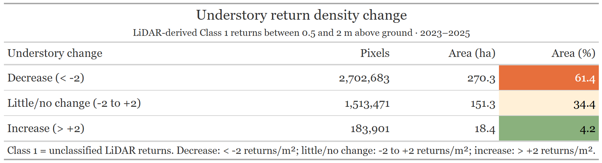

The understory analysis shows a predominantly negative change in low-height LiDAR return density between 2023 and 2025. Of the analysed vegetation area, 61.4% (270.3 ha) shows a decrease of more than 2 returns/m², while 34.4% (151.3 ha) shows little or no change. Only 4.2% (18.4 ha) shows an increase of more than 2 returns/m².

When separated by vegetation class, the mean change was more negative in Tree/Forest areas (-9.61 returns/m²) than in Scrub/Shrub areas (-6.71 returns/m²). The results therefore indicate a substantial reduction in low-height vegetation structure across the study area following the fire. However, Class 1 return density represents a LiDAR-based proxy for low-height vegetation structure and should not be interpreted directly as vegetation biomass or cover.

(See [`04_understory.R`](scripts/04_understory.R)).

## 3. Sentinel-2 Spectral Indices

The LiDAR analysis provides information on changes in vegetation structure following the fire. To complement this structural perspective, Sentinel-2 imagery was used to assess changes in vegetation condition and spectral response over time since Sentinel-2 provides spatially continuous spectral information that can be used to examine vegetation disturbance and subsequent recovery.

The selected scenes from December 2023 to January 2026 were used to calculate NDVI and NBR. The time series provides an additional perspective on the fire impact and allows changes in vegetation condition during the subsequent recovery period to be examined.

Two spectral vegetation indices were calculated:

- **NDVI** – Normalized Difference Vegetation Index
- **NBR** – Normalized Burn Ratio

These indices provide complementary information on vegetation condition and spectral changes associated with the fire.

### 3.1 NDVI
Normalized Difference Vegetation Index (NDVI) was calculated for selected Sentinel-2 scenes between December 2023 and January 2026 to examine changes in vegetation condition over time.

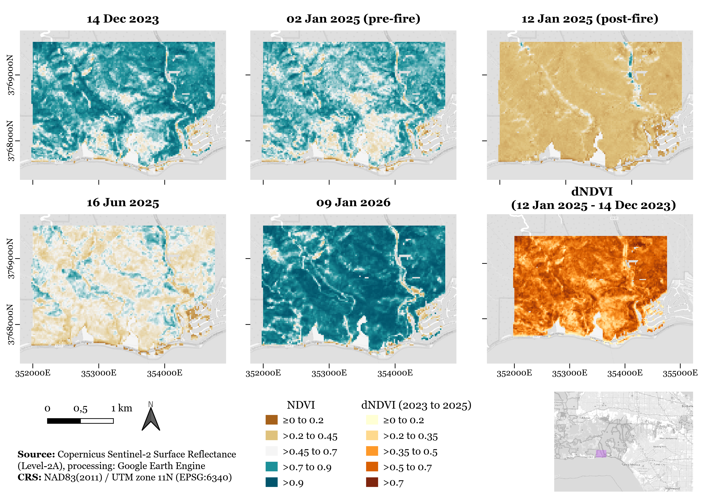

The NDVI time series shows a clear decrease in vegetation condition after the fire. The pre-fire observations from 14 December 2023 and 2 January 2025 show similar spatial patterns, while the 12 January 2025 post-fire observation shows substantially lower NDVI values. The difference map, dNDVI (12 Jan 2025 − 14 Dec 2023), highlights the spatial extent of this change. NDVI values increase again in June 2025 and January 2026, indicating a gradual recovery in the spectral vegetation response.

### 3.2 NBR
Normalized Burn Ratio (NBR) was calculated for the same Sentinel-2 scenes to characterize spectral changes associated with fire disturbance and vegetation recovery.

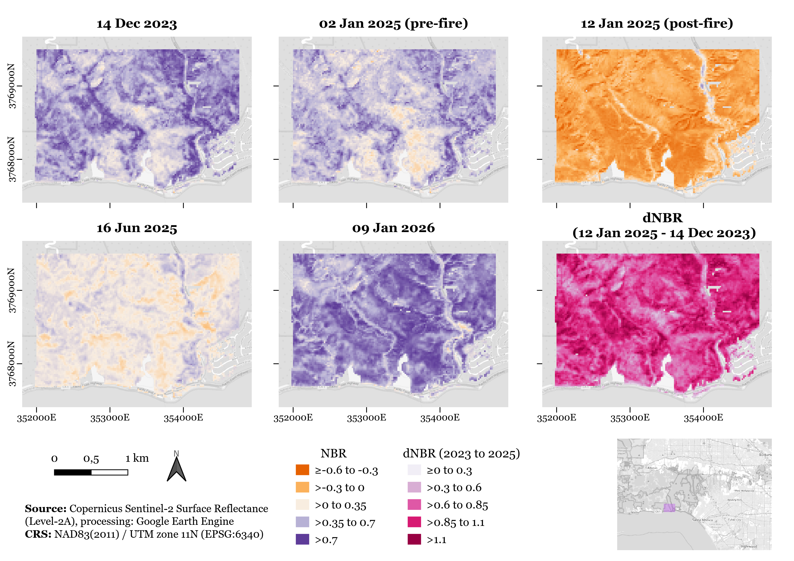

The NBR shows a pronounced spectral response to the fire. Compared with the pre-fire observations, NBR values decrease strongly in the 12 January 2025 post-fire observation. The corresponding dNBR (12 Jan 2025 − 14 Dec 2023) highlights the spatial extent of the fire-related spectral change. NBR values increase again in June 2025 and January 2026, indicating changes towards a higher post-fire spectral response.

### 4. Limitations

Several factors should be considered when interpreting the results:

- The 2023 and 2025 LiDAR datasets differ in acquisition period and point density. The 2023 dataset has a point density of 27.8 points/m², compared with 31.5 points/m² in 2025.
- The 2023 LiDAR data were acquired in December 2023, more than one year before the January 2025 fire. Therefore, the LiDAR comparison does not represent vegetation conditions immediately before the fire and may include changes unrelated to the fire.
- CHM differences represent changes in vegetation height and do not directly measure biomass loss.
- Low-height LiDAR return density is used as a proxy for low-height vegetation structure and does not directly represent biomass or vegetation cover.
- NOAA C-CAP vegetation classes represent land cover from 2021 and therefore do not describe vegetation conditions at the exact time of the fire.
- Airborne LiDAR data are generally available at much lower temporal frequency than satellite imagery, which limits their use for monitoring vegetation changes over short time periods.


### 5. Conclusion

The results show that airborne LiDAR can be used to quantify and visualize changes in vegetation structure following a wildfire. The comparison of the 2023 and 2025 datasets revealed substantial canopy height loss, with most areas showing more than 1 m of loss falling within the 2–5 m loss category. Low-height LiDAR return density also decreased across 61.4% of the analysed vegetation area, indicating a substantial reduction in low-height vegetation structure.

LiDAR provides important advantages for post-fire vegetation assessment through its high spatial resolution and ability to acquire data independently of cloud cover. This allows fine-scale structural changes to be mapped even when optical satellite imagery may be affected by clouds. At the same time, the relatively low temporal frequency of airborne LiDAR limits its use for continuous monitoring.

Sentinel-2 complemented the LiDAR analysis by providing a temporal perspective on vegetation condition. NDVI and NBR showed a pronounced spectral change immediately after the fire, followed by increasing values in the subsequent observations from June 2025 and January 2026. Together, the datasets provide complementary information: LiDAR captures changes in vegetation structure, while Sentinel-2 captures changes in spectral vegetation response over time.

